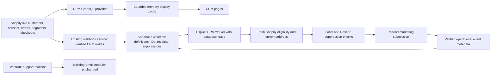

# CRM & Marketing V1 — Shopify first

Local implementation for review. **Marketing and test delivery default OFF.** No production migration, webhook registration, worker creation, customer changes, consent changes or email delivery was performed. Existing Klaviyo flows remain untouched.

## Authority and boundaries



Shopify owns customer names, addresses, consent, spend, order history, product relations, native segment membership, checkout contents and recovery URLs. They are fetched directly through the existing `shopify_sync` authentication and GraphQL transport. No CRM customer database or synchronization job exists.

Supabase contains only workflow configuration and execution state. Templates are reusable authored marketing configuration, not copies of customer messages. Rendered per-recipient HTML, plaintext, checkout contents and customer profiles are never written to CRM tables. Suppressions retain an address only when necessary to synchronize provider stop-state; the address is cleared after synchronization. An explicit test recipient can be retained on its operational test receipt.

CRM never imports support-email modules. The existing SMTP, IMAP, signatures, mailbox caches, IDLE watcher, composer, notifications and Files implementation were not changed.

## Pages and permissions

The existing sidebar gains **CRM & Marketing** immediately after Email. It contains Customers, Segments, Automations, Campaigns, Templates and Reports. Existing routing and Accounts & Access enforce respectively:

- `crm_customers_view`
- `crm_segments_view`
- `crm_automations_manage`
- `crm_campaigns_manage`
- `crm_templates_manage`
- `crm_reports_view`

Existing administrators can access all pages. Staff receive no new permissions automatically. Server-side action checks accompany UI checks; activation, scheduling, resume and test delivery additionally require their delivery gate. Top-bar search receives navigation metadata only, including Abandoned Checkout and Welcome Series. It performs no customer search or provider initialization.

CRM modules load only on a CRM route or explicit worker invocation. Webhook router declarations perform no database or provider I/O at import.

## Shopify reads, caching and cost

| Data | Memory TTL | Request size |
|---|---:|---|
| Customer list/search/detail | 45 seconds | 50 customers |
| Customer orders | 45 seconds | 20 orders; first 10 lines each |
| Remaining order/checkout lines | 30 seconds | 100 lines |
| Native segment definitions | 90 seconds | 50 segments |
| Segment members/counts | 45 seconds | 50 IDs plus one batched customer query |
| Abandoned checkout list/detail | 20 seconds | 25 IDs/status records; contents on detail only |
| Product metadata | 180 seconds | 50 products; first 5 collections each |
| Remaining product collections | 180 seconds | 100 collections |
| Derived purchase interests | 45 seconds | On-demand customer history |

The shared display cache is an LRU bounded to 256 entries and approximately 12 MiB, with copied return values and TTL eviction. No disk or Supabase cache exists. Current-session audience counts hold only counters, a cursor and hashed addresses for deduplication, capped at 100,000 eligible addresses. Refresh invalidates display data. Webhooks change a small durable version marker, which CRM pages check before reading cached data.

At most two GraphQL calls run concurrently per process. Query-cost/throttle metadata and `Retry-After` govern delays; transient failures retry at most three times. A requested wait over ten seconds fails safely so the UI can retry later. Nested initial queries are deliberately small, with separate pagination rather than a high-cost customer → orders → all lines → all collections query. Complex live rule evaluation has a 30-second deadline per customer and explicit pagination limits; it fails rather than silently treating truncated history as complete.

Fresh send validation bypasses display caches entirely. Actual production latency, query cost and protected-field availability still require read-only acceptance testing. Queries validate against the bundled Shopify Admin 2026-04 schema. Some existing supported fields are deprecated (`Customer.email`, `validEmailAddress`, `emailMarketingConsent`, `Product.featuredImage`, webhook `endpoint`); they are not removed in that schema. This implementation reuses the application's configured API version.

## Customers and profiles

The customer table uses live Shopify pagination, name/email/ID search and consent/country/order/last-purchase filters. Native segment selection resolves member IDs through Shopify. Interest filters evaluate purchases only for the current page; continue pagination for more matches. Filters within a native segment apply to its current fetched page and are labelled accordingly. No initial full-store scan occurs.

Summary counts use Shopify aggregate/segment queries. Store-wide lifetime revenue is `—` because the page does not scan the entire order database. Individual lifetime value and order count come from Shopify `amountSpent` and `numberOfOrders`. Profiles show average order value, first/last order, consent timestamp, paginated purchase history, variants, interests, owned editions, segment membership, operational marketing history and an existing Email navigation link.

Interests and segment details are opened on demand rather than issuing one request per visible customer. Interests derive from real purchase product types/tags/collection names for Motorsport, NBA, NFL, MLB, NRL, Cricket and Horse Racing. Native profile membership checks are batched for the first 50 segment definitions; the Segments page paginates further definitions. Edition ownership uses a read-only query of existing `edition_orders`, matching Shopify customer ID or exact email. It creates no ownership copies and never writes Edition Ops.

## Segments and audience counts

Native Shopify segments come first: current name, definition, updated time, member count and paginated member preview. Sports Cave stores rule definitions only, with bounded nested AND/OR groups and validated comparisons. Seventeen definitions are seeded: All Subscribed; New Subscribers—30 Days; AU; US; UK; Repeat Buyers; VIP Collectors; seven sport collector groups; Recent Buyers—30 Days; No Purchase—180 Days; Abandoned Checkout Eligible. VIP defaults to 1,000 in Shopify store currency and is editable as a rule.

The explicit audience counter scans one bounded live page per action and offers Continue counting when needed. It labels partial versus complete results, deduplicates addresses by hash, and checks live consent and local suppression. Resend suppression is rechecked for every actual delivery, so the displayed eligible count can decrease at submission. Large audiences should use native Shopify segments; V1 does not add a bulk customer export/mirror. Segment memberships are never persisted.

## Automation and campaign execution

Four seeded automations are **DRAFT**:

| Flow | Trigger and default sequence |
|---|---|
| Abandoned Checkout | Authoritative checkout reconciliation; 1 hour from abandonment, then 23 hours, then 48 hours; fresh checks before each email |
| Welcome Series | Actual subscribed consent update event; immediately, then 48 hours, then 60 hours |
| Post Purchase | Live paid, uncancelled Shopify order; 7 days later; marketing content, not transactional confirmation |
| Win Back | At least one order and no purchase for 180 days, configurable |

The linear editor supports delay, revalidation, send and stop. Each enrollment retains its reviewed step snapshot. The enrollment key combines automation and authoritative trigger identity; welcome also includes the consent timestamp and win-back the last-order identity. Events older than activation do not enroll historical customers. Checkout events expedite reconciliation; an active checkout event alone is never abandonment. Welcome does not infer consent from an email address, customer creation or purchase.

Before each customer send: fetch fresh Shopify customer/consent/address, re-query relevant checkout/order, check local suppression, check Resend suppression/contact unsubscribe, render the pinned template in memory, recheck local suppression, and atomically fence the submission claim. Abandonment stops on completion/recovery, a newer order even if payment is pending, invalid consent/address, changed checkout customer or suppression. Win-back rechecks the latest order; post-purchase checks current paid/uncancelled state.

Campaigns support native/custom audiences, count/preview, content editing, pinned template preview, explicit test recipient, draft save, gated schedule/send, pause and resume. Recipient IDs resolve live in bounded pages at execution. Persisted receipts contain customer ID, recipient hash, campaign/enrollment/step IDs, template version, state, timestamps, lease, provider ID and stable idempotency key—not names, customer email/profile, checkout contents or rendered bodies. Unique campaign/customer and campaign/address-hash constraints prevent duplicates. Current address and consent are queried anew before submission.

An explicit worker command (`python crm_worker.py`) drains database due work every 30 seconds. `--once` runs one bounded cycle; `--seed` inserts draft configuration only. No worker starts from Streamlit import. A renewable 5-minute database leader lease fences workers; send claims have independent tokens/leases and use `FOR UPDATE SKIP LOCKED`. Pausing during validation prevents the submission transition. Paused campaigns preserve their cursor and prior stage for resume.

Before-submission source failures retry at five-minute intervals, at most five attempts. Once a receipt becomes SUBMITTING, an interrupted/ambiguous response is held UNCERTAIN and never automatically replayed—even after Resend's idempotency retention expires. Explicit rejection becomes FAILED. Accepted submissions become ACCEPTED only on the provider receipt. Resend receives the stable idempotency key, with transport retries disabled for submission. Request pacing leaves at least 550 ms between CRM Resend requests. Existing support SMTP is unaffected.

## Templates, unsubscribe and events

Nine editable versioned templates: Abandoned Checkout 1–3, Welcome 1–3, Post Purchase, Win Back, Product Launch. They include subject, preview, headline, plaintext body editing, CTA, optional product block and separate marketing footer. Rendering escapes content into conservative inline-styled table HTML, includes plain text, HTTPS CTA validation, unsubscribe and stable UTM parameters. Only four explicit placeholders are permitted. The official `static/branding/sports-cave-os-icon-192-v2.png` is reused at 48px. Local previews embed it; outgoing mail uses its public application static URL. Nathan/Maria support signatures are not used or modified.

Shopify SUBSCRIBED with a valid address is necessary but not sufficient: local and Resend suppressions also must permit delivery. No `write_customers` operation exists. Footer links use an HMAC-signed receipt UUID without exposing customer email. GET displays confirmation so link scanners do not unsubscribe; POST immediately writes local suppression without depending on Shopify availability. The worker synchronizes Resend suppression, resolving the original address from its delivery receipt when needed. Resend bounce/complaint/suppression events also block future sends. **Shopify consent is not written back in V1**, so Shopify can still display its prior consent value; the effective local/provider block takes precedence.

Resend webhook requests verify Svix signatures against raw bytes with timestamp tolerance. Shopify CRM webhooks reuse the existing raw-body HMAC verifier and additionally check the configured shop domain. Both enforce a 2 MiB request bound, store minimal metadata and deduplicate event IDs; no raw webhook payload is retained. Public error responses omit secrets and payloads.

Reports show sends, delivered, open/click rates, bounces, complaints, unsubscribes, automation enrollment/completion/recovery and campaign totals. Events deduplicate provider IDs for metrics. Test sends are excluded. Opens/clicks can reflect email-client privacy activity. Revenue attribution is `—`; recovered checkout state does not establish causation. Held/failed/excluded deliveries are visible without customer content.

## Exact database objects

The reviewed migration is **`migrations/20260927093818_crm_marketing_v1.sql`**. It is not added to an automatic deployment migration manifest. It defines eleven tables:

1. `crm_segment_definitions`
2. `crm_templates`
3. `crm_template_versions`
4. `crm_automations`
5. `crm_automation_enrollments`
6. `crm_campaigns`
7. `crm_marketing_sends` (also recipient/step-run state)
8. `crm_marketing_events`
9. `crm_suppressions`
10. `crm_webhook_events`
11. `crm_runtime_state`

All enable RLS and revoke PUBLIC/anon/authenticated access. Server code reuses the existing private PostgreSQL connection. No browser service key is introduced. No production tables have been created. Tests apply the SQL only to an in-memory disposable local PostgreSQL fixture.

There is **no `crm_customers`, Shopify order mirror, product mirror, segment membership table, checkout content table, customer interest mirror or full-message storage**.

## Required configuration and later deployment

Reuse existing Shopify auth (`shopify_sync`), private database configuration, `RESEND_API_KEY`, Shopify webhook signing secret and configured shop domain. Do not change existing support credentials.

| Variable | Purpose / safe initial value |
|---|---|
| `CRM_MARKETING_SEND_ENABLED` | `false` (default); governs customer delivery, activation, scheduling/resume |
| `CRM_MARKETING_TEST_ENABLED` | `false` (default); independently gates explicit test receipts |
| `CRM_MARKETING_FROM` | Optional verified Resend marketing sender; falls back to existing `ACTIVITY_DIGEST_FROM` |
| `ACTIVITY_DIGEST_REPLY_TO` | Existing reply-to, defaults to `hello@sportscaveshop.com` |
| `CRM_PUBLIC_BASE_URL` | Existing public webhook service HTTPS origin; falls back to `SPORTS_CAVE_WEBHOOK_BASE_URL` |
| `CRM_UNSUBSCRIBE_SECRET` | Private random signing secret, at least 32 characters; preserve across restarts |
| `CRM_RESEND_WEBHOOK_SECRET` | Signing secret for the later Resend CRM webhook endpoint |
| `SPORTS_CAVE_OS_BASE_URL` | Existing public app origin for the official static logo; `PUBLIC_APP_URL` is fallback |

After separate approval, the worker would be a **supporting background worker named `sports-cave-crm-worker`, one instance, command `python crm_worker.py`**, using the same reviewed code and existing server credentials. It must not be another primary web service. The canonical `sports-cave-os` service identity and all current supporting services remain unchanged. No `render.yaml` edit or service creation was performed. Any future Blueprint change must follow `docs/RENDER_SERVICE_TOPOLOGY.md`, run the topology validator and inspect its preview before applying.

CRM routes on the existing webhook service:

- `POST /webhooks/shopify/crm`
- `POST /webhooks/resend/crm`
- `GET/POST /crm/unsubscribe`

Shopify topics evaluated by the local registration helper: `customers/create`, `customers/update`, `customers/delete`, **`customers_email_marketing_consent/update`**, `orders/create`, `orders/updated`, `orders/cancelled`, `checkouts/create`, `checkouts/update`, `checkouts/delete`. The existing orders/paid fulfillment route/registration is unchanged; CRM rechecks `fullyPaid` on orders/updated. Compliance customer-redaction delivery must be wired through the app's existing compliance configuration, not a duplicate manual notification.

`python scripts/register_crm_webhooks.py` is a read-only registration preview. `--apply` creates missing topics only. If a topic already has another callback, it reports that conflict and does not duplicate or replace it; review forwarding through that existing handler before activation. **Neither command was run against production.** Do not activate a flow until its required real event reaches this verified route.

### Controlled activation sequence — only after approval

1. Review code/schema and the regression report. Keep both delivery gates false.
2. Apply the single migration through the established reviewed database migration process; verify all eleven RLS tables/privileges.
3. Run `python crm_worker.py --seed` once, or use the existing admin-only Initialize draft library action. Verify four DRAFT flows, nine templates, seventeen definitions.
4. Deploy the reviewed application/webhook code for read-only CRM testing. Check live customer pagination, native segments, customer history, orders and consent against Shopify. Confirm support Email still works.
5. Configure the public unsubscribe origin, durable signing secret, verified sender and Resend webhook secret. Verify the official logo loads publicly.
6. Preview Shopify registrations; resolve existing callback conflicts without duplication. Only then apply missing registrations. Configure signed Resend events on the existing webhook service. Test HMAC/Svix failures, deduplication and cache invalidation.
7. Create the single supporting worker after topology review. Leave customer delivery false; verify idle draft-only processing and restart/lease behavior.
8. Enable **test-only** delivery for a deliberately entered internal recipient after specific approval. Verify HTML/plaintext, links, unsubscribe, provider suppression, events and uncertain-send handling.
9. Review equivalent Klaviyo flows and consent/suppression history. Agree cutover ownership; do not let both systems send the same automation. Import only necessary stop-state through a separately reviewed procedure if required.
10. Only after controlled acceptance: enable customer delivery, explicitly activate one approved flow/campaign, observe provider receipts and stop conditions, then expand gradually. No historic welcome enrollment is backfilled automatically.

Before turning off equivalent Klaviyo flows: verified event coverage, current suppression coverage, template approval, internal delivery/unsubscribe tests, worker restart/idempotency tests, Shopify read-only parity, sender/domain verification and an agreed cutover/rollback plan are still required. V1 must not be described as production marketing already activated.

## Local verification

All customer records and delivery providers in tests are fabricated. External API and production database use are blocked in the browser fixture.

```powershell
npm ci --prefix tests/fixtures/crm --ignore-scripts
node tests/crm_postgres_server.mjs
# Another terminal, isolated PostgreSQL fixture must be running:
$env:CRM_TEST_POSTGRES='1'
.venv/Scripts/python.exe -m unittest tests.test_crm tests.test_crm_boundaries tests.test_crm_postgres tests.test_crm_ui -q
.venv/Scripts/python.exe tests/profile_crm.py
.venv/Scripts/python.exe tests/fixtures/crm_preview.py --serve
# Browse http://127.0.0.1:8510/ — actual OS shell, fabricated Shopify/Email.
```

The PostgreSQL fixture is loopback-only, disposable and uses pinned PGlite 0.5.8. Its API is for local tests only and is not deployed. Unit tests truncate only this explicit fixture. Install requires registry access; this run reused an already installed copy after the sandbox denied npm network access.

Detailed results, screenshots, changed-file inventory and the requested 45-point completion report are in `docs/CRM_MARKETING_V1_REPORT.md`.
